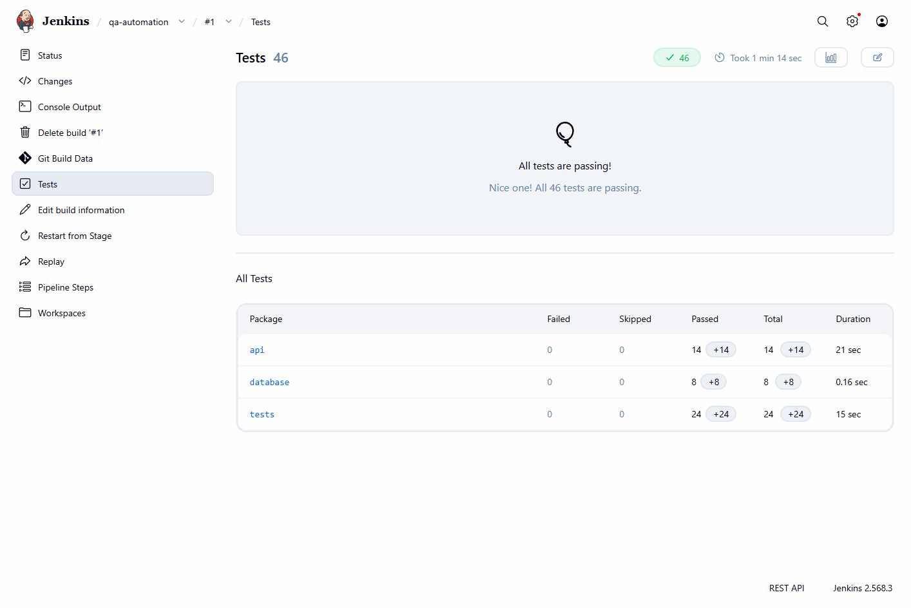

# Jenkins integration

## Local Jenkins pipeline

[Jenkinsfile](../Jenkinsfile) reuses the existing Maven tests. GitHub Actions remains available.

Pipeline: SCM checkout → environment checks and clean compilation → isolated PostgreSQL → API (14) → database (8) → headless Web (24) → reports/artifacts → database cleanup.

- Select `chrome` (default) or `firefox` through the `BROWSER` parameter.
- The agent label is `qa-local`. Provide Java 21+, Git, a supported browser and a running Linux Docker engine on that node.
- Required plugins: **Pipeline**, **Git**, **JUnit**, including their dependencies. Allure HTML is generated by Maven and archived; no Jenkins Allure plugin is required or configured.
- Surefire XML is published through Jenkins' test results view. Download archived Allure HTML as a directory/ZIP and serve it locally to view it. No inline HTML dashboard plugin is configured.
- API, database and Web reports use separate directories. Allure results accumulate within one build after an initial `clean`.
- A failed test stage marks the build as failed while allowing remaining test stages and diagnostics to run. Cancellation/timeouts are not intentionally swallowed.
- Builds of this job cannot overlap. Its fixture uses port **55433** and Compose project `qa-jenkins-BUILD_NUMBER`; normal local tests use **55432** and `qa-automation-v4`.
- Cleanup removes only the uniquely named build fixture and its disposable volume. Abrupt controller/agent termination can prevent cleanup; inspect leftover `qa-jenkins-*` resources before removing them.
- Keep 10 builds and artifacts for the latest 5 builds. Public service and network failures remain possible.

### This computer

Jenkins lives under ignored `.tools/jenkins/` and binds only to **http://127.0.0.1:8081/**. Authentication is required; anonymous access and inbound agent connections are disabled. The local administrator name/password are in `.tools/jenkins/admin.json`. Never commit that file or Jenkins home; they contain instance secrets.

Start the installed instance from the project root:

```powershell
.\scripts\Start-Jenkins.ps1
```

Open `qa-automation` and use **Build Now**, or **Build with Parameters** after the first run. Starting Jenkins does not start Docker Desktop. This personal learning instance uses one built-in executor and is suitable only for trusted code. Shared deployments should use separate agents and managed credentials.

### Recreate elsewhere

1. Install supported Java and the [Jenkins LTS WAR](https://www.jenkins.io/doc/book/installing/war-file/). For the Windows launcher, place it at `.tools/jenkins/jenkins.war`; launch and complete Jenkins' setup wizard to create an administrator.
2. Install Pipeline, Git and JUnit through Manage Jenkins → Plugins. Configure a node labelled `qa-local` with the prerequisites above.
3. Create a **Pipeline** job. Select **Pipeline script from SCM → Git**, repository `https://github.com/LeyuLeyuWang/end-to-end-qa-automation-framework.git`, branch `*/main`, script path `Jenkinsfile`.
4. Start Docker and build. Confirm 46 test results, archived files and removal of the build-specific fixture.

The job is manually triggered. No webhook, public tunnel, scheduled polling or Internet-facing Jenkins endpoint is configured. This setup does not provide automatic push-triggered Jenkins execution.

### Verified run

On **2026-09-16**, local Jenkins **2.568.3** build **#1** checked out commit `ec56997` from GitHub and finished **SUCCESS** using Java 21 and headless Chrome:

| Suite | Passed | Failed | Skipped |
|---|---:|---:|---:|
| API | 14 | 0 | 0 |
| Database | 8 | 0 | 0 |
| Web | 24 | 0 | 0 |
| Total | 46 | 0 | 0 |

Jenkins published all 46 results and archived 350 files, including the Allure HTML, raw results and PostgreSQL log. The Allure summary independently reports 46 passed. The build's database container and volume were confirmed removed. This verifies the Chrome Jenkins path; Firefox remains selectable but was not rerun through Jenkins in this acceptance run.



## 本地 Jenkins 流水线

新增 Jenkinsfile 复用现有测试，保留 GitHub Actions。阶段包括拉取 GitHub、环境检查、独立数据库启动、API 14 个、数据库 8 个、无头 Web 24 个、报告归档和清理。

访问 **http://127.0.0.1:8081/**；本机账号密码在 `.tools/jenkins/admin.json`，该目录被 Git 忽略。重启入口为 `scripts/Start-Jenkins.ps1`，另需启动 Docker Desktop。

任务名 `qa-automation`。首次使用 Build Now，之后在 Build with Parameters 中选择 Chrome 或 Firefox。`qa-local` 是节点标签。Jenkins 发布测试结果，保存 Allure 原始结果、HTML、失败截图与数据库日志。没有安装内嵌 Allure 展示插件，HTML 产物下载后通过本地服务查看。

端口 55433 与普通测试的 55432 分离。每次构建的 Compose 项目名为 qa-jenkins-构建号，最后只删除本次容器和临时数据卷。测试失败后仍尝试其他阶段，最终构建保持失败；进程被强制终止时清理不能保证。

这是需要登录、仅本机可访问的个人学习实例，使用一个内置执行槽，只运行可信代码。没有公网开放、GitHub webhook 或定时轮询，当前手动触发；团队部署应使用独立 agent 与统一凭据管理。

**2026-09-16 实测：** Jenkins 2.568.3 的第 1 次构建从 GitHub 拉取 `ec56997`，以 Java 21 和 Chrome 无头运行，最终 SUCCESS。46 个场景全部通过，0 失败、0 跳过；Jenkins 测试统计与 Allure 统计一致，归档 350 个文件。已核对本次数据库容器和卷没有残留。本轮未通过 Jenkins 额外重跑 Firefox。

本机 Docker 启动时发现损坏的运行时通信文件。已将原运行目录保留为 `%LOCALAPPDATA%\Docker\run.backup-20260916-jenkins` 后重建运行目录，未重置 Docker、删除镜像或已有数据卷。
